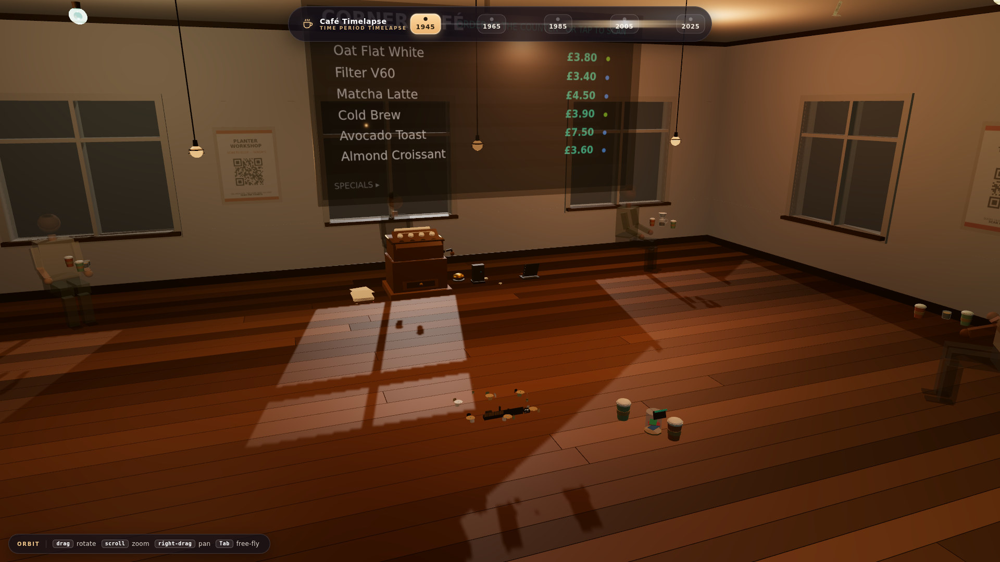
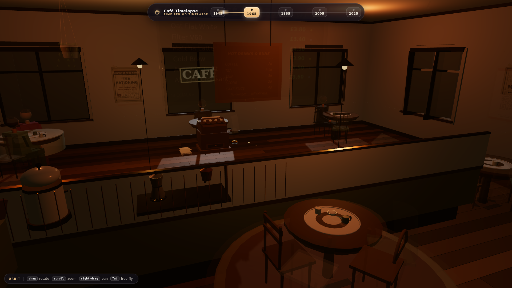
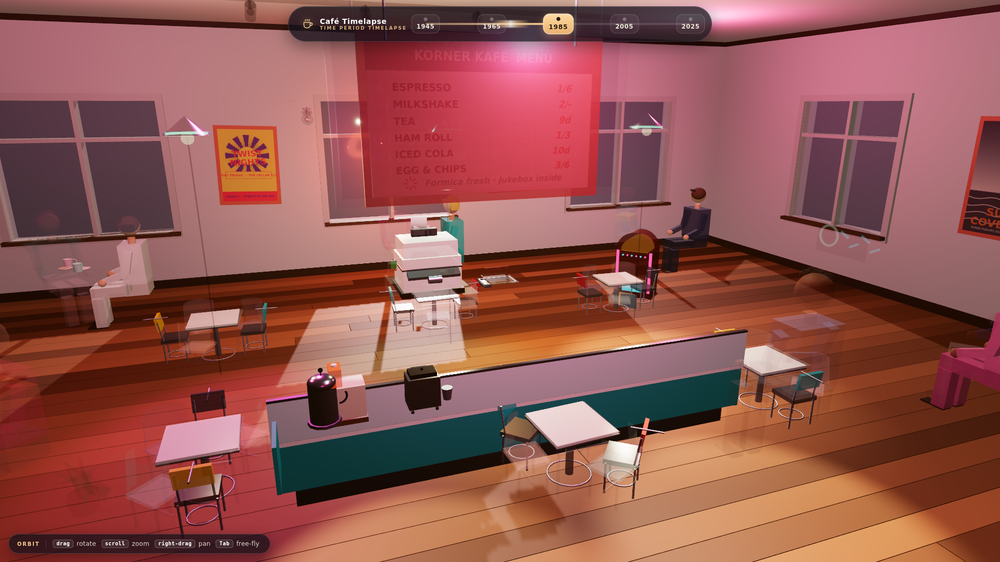
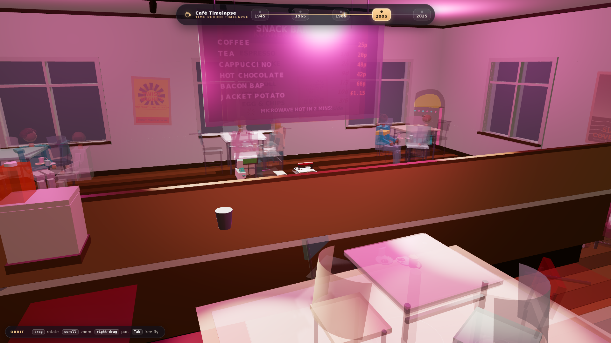
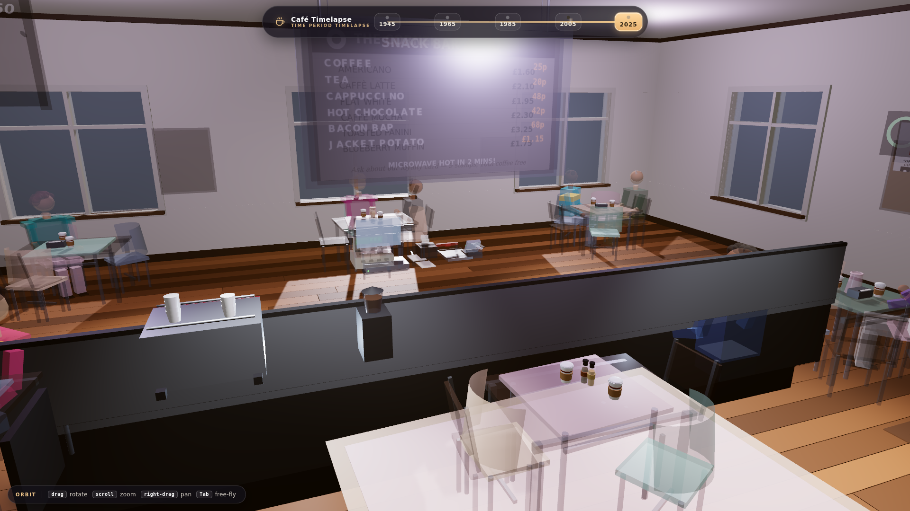
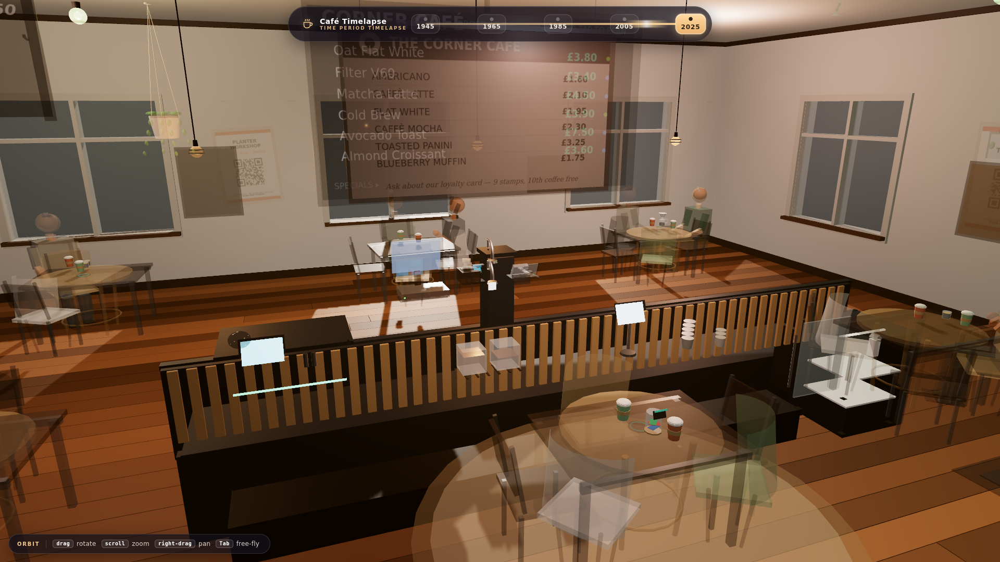

# Café Time Period Timelapse

A fully explorable 3D café interior that **transforms in front of your eyes** across a
hundred-plus years of history. Pick any stop on the timeline — 1945, 1965, 1985, 2005,
2025 or 2055 — and every detail of the room morphs to its period: furniture and decor,
coffee machines and brewing equipment, the menu board and its prices, what music plays
and from which machine, posters and advertisements, tableware, signage and lighting, the
technology at the counter, even the outfits, hairstyles and gadgets of the patrons.

Built with Vite + TypeScript + Three.js. No external assets: every texture is painted
procedurally on canvases and every mesh is generated code.



## The six eras

| Year | The room |
| --- | --- |
| **1945** | Blackout gloom — cold daylight through taped windows, warm gas/filament pockets, wartime rationing on the menu. |
| **1965** | Diner brightness — fluorescent fill, cherry-red neon accents, jukebox by the door. |
| **1985** | Vivid mall-era pop — magenta/cyan gels under halogen punch, boombox and arcade cabinet glow. |
| **2005** | Cool café-retail white — blue-white LED washes, flat-screens and an iPod in a patron's hand. |
| **2025** | Layered smart-café scene — softest fog, phone payments at the counter, sustainable everything. |
| **2055** | The horizon year — systems without a dedicated 2055 set hold their nearest period look while lighting and atmosphere keep morphing. |

Every era swaps all eight content categories with a ~1.2 s animated morph. Grab the
timeline mid-morph and it retargets seamlessly from whatever is on screen — nothing snaps.

| | | |
| --- | --- | --- |
|  |  |  |
|  |  |  |

## Controls

An on-screen hint chip (bottom-left) always mirrors the active mode.

### Orbit mode (default)

| Input | Action |
| --- | --- |
| `drag` | Rotate around the room centre (damped) |
| `scroll` | Zoom |
| `right-drag` | Pan |
| `Tab` | Switch to free-fly |

Orbit keeps you softly clamped inside the room shell — you can circle and dive, never
leave or sink through the floor.

### Free-fly / inspect mode

| Input | Action |
| --- | --- |
| `click` | Capture the mouse (pointer-lock mouse look) |
| `W A S D` | Move relative to your view |
| `Q` / `E` | Down / up |
| `scroll` | Speed ×1.0 → ×… (multiplicative steps) |
| `click` on a prop | Inspect — eased close-up framing of what you clicked |
| `Tab` | Back to orbit |

Fly mode is made for up-close inspection: get nose-to-nose with the 1945 till or read the
chalk specials on today's board. Every camera motion is eased; a subtle vignette marks
focus travel.

### Timeline slider (top bar)

Click a year chip or anywhere on the rail. The active stop glides, a shimmer sweeps from
the departure to the target era, and each category crossfades/pops/hard-cuts at the
halfway commit point. Spamming stops is safe — transitions chain cleanly from live state.

## Running it

```bash
npm install
npm run dev        # http://localhost:5173
```

| Command | Description |
| --- | --- |
| `npm run dev` | Dev server with hot reload |
| `npm run build` | Type-check (`tsc --noEmit`) + optimized production build into `dist/` |
| `npm run preview` | Serve the production build locally |
| `npm test` | Vitest suite (86 tests) |

Optional tooling:

```bash
node scripts/capture-screenshots.mjs   # re-capture docs/screenshots/*.png from dist/
                                        # (headless Chromium + SwiftShader WebGL;
                                        #  CHROMIUM_PATH/CAP_PORT env overrides available)
```

## Performance pass

The default view holds ≥45 fps at 1080p on typical discrete GPUs and stays well above
~20 fps mid-morph on integrated graphics. Fidelity was never traded away — the wins are
structural:

- **Merged static shell.** The permanent room used to spend 139 draw calls (64 loose
  floor planks alone); per-material geometry merging (`BufferGeometryUtils`) drops the
  whole shell to ~14 meshes — floor shades, walls+ceiling, joinery, glazing, sills, trim,
  leaf wood — plus frozen matrices (`matrixAutoUpdate = false`). Enforced by
  `src/cafe/perf/renderBudget.test.ts`.
- **Frame budgets under test.** Per-era visible meshes ≤720 (measured ≈640–700), unique
  materials ≤200, total graph ≤3 400 meshes across all dormant era sets.
- **Texture anisotropy from device caps.** All procedural textures (menus, posters,
  signage) sample with real `renderer.capabilities.getMaxAnisotropy()` (capped at 16,
  floored at 4) so chalk lettering survives grazing-angle close-ups.
- **Tuned shadow map.** One shadow-casting sun at 2048² with the ortho frustum tightened
  from ±12 m to ±6.5 m — roughly double the ground texel density (~160 texels/m) for
  crisper contact shadows at identical cost.
- **Transition render governor.** While any morph plays, the drawing buffer drops to
  ≤1 device pixel and shadows run at 1024²; both snap back exactly on completion. Mid-morph
  is when both eras' content coexists — that's where headroom matters.
- **MSAA presentation pipeline.** HalfFloat 4×-multisampled target → subtle grade/vignette
  → tone map + sRGB output.

## Verification highlights

- `EraTransitionController.cycle.test.ts` drives **every ordered era pair** (30 directed
  morphs + identity no-ops, mid-morph retargets and slider spam) on an animated scene and
  compares the settled result *exactly* against a control scene that cold-applied the same
  year — pinning opacity/transparent/depthWrite restoration, scale restoration, shadow-flag
  restoration, light/fog end states and NaN freedom.
- Two real transition bugs were found and fixed by that sweep: shared materials minting
  duplicate fade baselines (stuck `depthWrite=false` after any morph), and eras whose mood
  record omits fields being pinned back to the departure era's lighting ("lights flash
  back to the old room") — undefined channels now reseed from the updater-authored state
  at commit.
- `renderBudget.test.ts` guards the draw-call/material budgets above.

## Project structure

```
index.html                       HTML entrypoint mounting the full-viewport canvas
src/main.ts                      App shell: renderer, composer, loop, loading overlay,
                                 cinematic intro, timeline wiring, transition governor
src/cafe/CafeScene.ts            Room shell (merged static geometry), lighting rig,
                                 prop-group registry, bounds/close-up framing
src/cafe/EraTransitionController.ts   The ~1.2 s morph engine (crossfade/scalePop/
                                 instantSwap strategies, retarget-safe baselines)
src/cafe/NavigationController.ts Orbit + free-fly navigation, focus inspector, hint chip
src/cafe/types.ts                EraYear / EraConfig / prop-group contracts
src/cafe/rendering/textureQuality.ts  Device-cap texture filtering
src/cafe/eras/                   Neutral era lookup seam (era configs)
src/cafe/props/                  The eight swappable detail categories:
                                 furniture · machines · menu · posters · tableware ·
                                 signage · counterTech · patrons
src/ui/TimelineSlider.ts         Top-bar year selector + morph shimmer
src/cafe/perf/                   Render-budget regression tests
scripts/capture-screenshots.mjs  Headless era-screenshot capture for this README
docs/screenshots/                Captured era stills (1920×1080)
```
